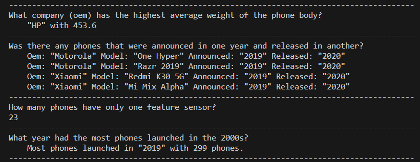

# Alternative Language Assignment

The purpose of this assignment was to explore a language that I was not familiar with.

## Table of Contents
1. [Which Programming Language?](#which-programming-language-and-version-did-you-pick?)
2. [Why This Language](#why-this-language)
3. [Language Design Basics](#language-design-basics)
4. [Libraries Used](#libraries-used)
5. [Analysis](#analysis)
6. [Resources](#resources)

## Instructions

To run tests from the terminal run
```sh
cargo test
```
To run the code from the terminal run
```sh
cargo run
```

Note that these commands will output warnings due to unused methods that were part of requirements, but not necessary to answer the analysis questions.

## Which Programming Language?

I selected the Rust programming language 2021 edition.

## Why This Language?

Rust's memory model is what first interested me. It is designed around memory safety and tries to guide the programmer to write code in a way that is memory safe. I thought this was a really interesting concept that I wanted to explore further. I still have not completely understood the model yet, but I learned quite a bit about the languages concept of _ownership_.

## Language Design Basics

**Object-oriented Programming**

Rust supports some features of the OOP paradigm. It is object oriented. The data structures that support object behavior are called structs, enums, and impl. Encapsulation of data is supported with private data attributes that can be accessed with public functions.

Inheritance and polymorphism is not supported. There are other design patterns within Rust that can provide similar behavior. Generic traits are used implement behavior:

```rust
pub struct NewsArticle {
    pub headline: String,
    pub location: String,
    pub author: String,
    pub content: String,
}

impl Summary for NewsArticle {
    fn summarize(&self) -> String {
        format!("{}, by {} ({})", self.headline, self.author, self.location)
    }
}

pub struct Tweet {
    pub username: String,
    pub content: String,
    pub reply: bool,
    pub retweet: bool,
}

impl Summary for Tweet {
    fn summarize(&self) -> String {
        format!("{}: {}", self.username, self.content)
    }
}
```

On the surface this reminds me of Interfaces and Classes in Java. However, this is not the case. There are restrictions on scope that limit how tratis are implemented.

See the [Object Oriented Features Ch. 17](https://doc.rust-lang.org/book/ch17-00-oop.html) for further details on object oriented programming. See [Traits: Defining Shared Behavior](https://doc.rust-lang.org/book/ch10-02-traits.html) for more on traits.

**File Ingestion**

Rust provides file reading out of the box and there are many crates available that provide specific support for certain file types. Two are included in this project.

```rust
use std::env;
use std::fs;

fn main() {
    println!("In file {}", file_path);

    let contents = fs::read_to_string(file_path)
        .expect("Should have been able to read the file");

    println!("With text:\n{contents}");
}
```

**Conditional Statements**

If conditions:

```rust
fn main() {
    let number = 3;

    if number < 5 {
        println!("condition was true");
    } else {
        println!("condition was false");
    }
}
```

Match Control Construct:

```rust
fn match(num: u8) -> u8 {
    match num {
        3 => {
            // do some code stuff
            3 + 5 // return 
        }
        9 => 5,
        1 => 10,
        7 => 25,
        _ => 0, // default catch all
    }
}
```

If let Construct:

```rust
// removes some boilerplate typing of the match syntax if 
// you only need to match against one case
let num = Some(u8);
if let Some(match_num) = num {
    println!("The maximum is configured to be {}", num);
}

```

**Assignment Statements**

The let statement handles assignment.

```rust
let x = 0; // implicit variable of default type i32
let y = 0.0; // implicit variable of default type f64

let z : u32 = 1; // explicit variable of unsigned int type
let a_vec : Vec<String> = Vec::<String>::new() // explicit vector assignment with type

Syntax
LetStatement :
    OuterAttribute* let PatternNoTopAlt ( : Type )? (= Expression † ( else BlockExpression) ? ) ? ;

† When an else block is specified, the Expression must not be a LazyBooleanExpression, or end with a }.
```

**Loops**

```rust
loop {
    // I am an infinite loop
}

while i < 10 {
    // runs conditionally
    i += 1;
}

for i in some_iterable {
    // i becomes each object in some_iterable
}

for k, v in some_map_iterable {
    // k is the key, v is the value
}
```

**Subprograms**

_fn_ defines the function followed by the function name. Parenthesis follow. If the function takes parameters then those are defined inside with the sytax _variable name : variable type_. If there is a return value there will be the arrow symbol _->_ with the return type after before the opening curly brace of the function block scope.


```rust
// implicit return without return keyword
fn function_name(x: i32) -> i32 {
    x + 1
}
```
An interesting point to note about the above example is that if there is a semi colon added to the end of the first statement inside the function it will not compile. The omission of the semi-colon changes this to a return statement. If the semi-colon is added then it is a just a statement and the function would be missing a return statement entirely.

```rust
// explicit return
fn function_name(x: i32) -> i32 {
    let y = x + 1;
    return y;
}
```
A return keyword is not required when the last element in the function is the element to return. The keyword is used for early returns mostly.

**Unit Testing**

Testing is built into the languages.

```rust
// test functions encapsulated in test module
#[cfg(test)]
mod tests {
    #[test]
    fn test_func_name() {
        // the code that is tested
        // assert result and the expected result
        assert_eq!(result, 4);
    }
}
```
One thing I like about this is that I can write a test anywhere. I do not have to set up a test runner and file structure for this to work. I can write a test and then write the function right below it then run the tests using command line:

```sh
cargo test
```

**Exception Handling**

Rust does not have exceptions. Instead it has the `Result<T, E>` type for recoverable errors and the panic! macro that stops execution when the program encounters an unrecoverable error.

```rust
// example panic! only
fn main() {
    panic!("crash and burn");
}

// definition of Result<T, E>
enum Result<T, E> {
    Ok(T),
    Err(E),
}

// example of both Result<T, E> and panic!
use std::fs::File;

fn main() {
    let greeting_file_result = File::open("hello.txt");

    let greeting_file = match greeting_file_result {
        Ok(file) => file,
        Err(error) => panic!("Problem opening the file: {:?}", error),
    };
}
```
There are more details and guidelines about when and why you would choose to use either or both in the documentation.

### Libraries Used

Rust calls libraries _crates_. I used the following:

1. csv - Provides many common csv file handling options. I used this to read in a csv file.
2. regex - For handling regex I selected it as it was the most popular and accessible option. I used this for filtering and cleaning column data.
3. serde - A serialization tool that provides tools for serialization and deserialization of common file formats and the ability
to write custom serializers and de-serializers. I chose this tool because it is one of the most popular crates available. Translating objects is a very common task so I decided to jump in and try to learn how to use one aspect of it. I used this as a first pass over the csv data that was read in. It provides some default handling for null values. Then I used it to deserialize and read in StringBuilder data to a struct.

<sub>_note_: see [cargo.toml](../cargo.toml) more details about libraries.</sub>

### Analysis



## Resources

[1] "The Rust Programming Language - The Rust Programming Language," doc.rust-lang.org. https://doc.rust-lang.org/stable/book/. Visited May 5, 2023.

[2] "Table of Contents - Rust Cookbook," rust-lang-nursery.github.io. https://rust-lang-nursery.github.io/rust-cookbook/. Visited May 5, 2023.

‌

‌